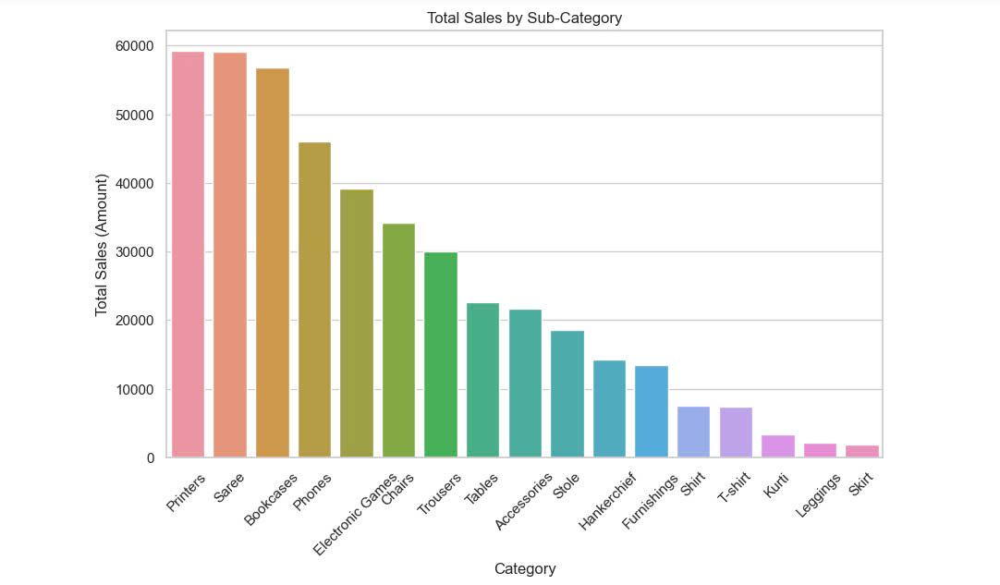

Discription: 
- The chart has 15 product categories but the product category with the highest sales is "Printers" with about 60,000 while the lowest category is "Skirt" with only about 2,000

Reviews: 
- Can see the results of the dependent variable based on the milestones of the variable, and we have applied it and 2 variables have a relationship that affects each other, which is “total purchase quantity and profit”. In the chart, we see both negative and positive profits, there are points that show the highest profit that can reach more than 1500, however, there are some points that are the opposite, the total purchase quantity is not too low, however, there are many data points that are randomly scattered, which shows that many other factors can affect the profit. that is, the profit does not increase or decrease with the number of sales. This may be due to many other factors that affect the profit, such as production costs, selling prices, and marketing costs.

Purpose for business:
- The purpose of the chart helps businesses to see the comparison and analysis of the effectiveness and sales performance between product categories
- Provide an overview of the business's revenue
- Make the most accurate and effective assessments of each product, rebuild the business strategy, need to change and edit which items to suit the user

Purpose for customers:
- Can clearly see to meet customer needs
- Edit, prioritize the quality of popular items
- Overcome the shortcomings of unsuitable products to increase optimization

Lessons:
- Recognize and focus on key products: Products with High revenue should be focused on improving quality, as well as marketing campaigns
- Change weak products: It is necessary to point out and fix the reasons why products have low revenue, have not achieved the desired sales. Provide diverse strategies for change (packaging, approach, group of people ..)
- Diversify products: Although it is advisable to focus on core products, businesses also need to diversify products to reduce risks and increase competitiveness.
- Launch new products, create differences: Research and develop new products to meet customer needs and expand the market. Create innovation and creativity to stimulate buyers

