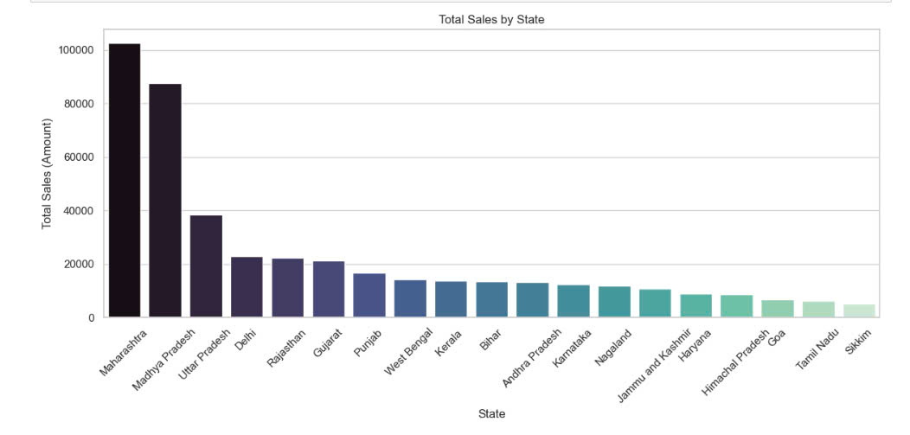

Description: In general, based on the column chart above, it can be seen that total sales revenue by each state is unevenly distributed.
- Little The state "Maharashtra" has the highest sales revenue almost surpassing other states. Next is the states of Madhya Pradesh and Uttar Pradesh
- The states with relatively equal sales revenue are the states located in North India which are Delhi, Rajasthan and Gujanat showing relative growth.
- The remaining states have almost completely lower revenues with output below 20,000 and the lowest is the state of Mizoram, showing worrying signs about the level of development of these states due to many economic impacts. population density, spending levels and infrastructure
- The large difference in revenue of the highest and lowest states is about 34 times

Reviews: 
- Because the states of Maharashtra, Madhya Pradesh, and Uttar Pradesh are large states of India, they have large economies, high population density and GDP, so consumption levels are good.
- In addition, Northern India, which is Delhi, Rajasthan and Gujanat, is also gradually developing with a stable level of purchasing and may be a potential market in the near future.
- On the contrary, the remaining states still have many restrictions, especially the state of Mizoram The population is low due to the need for economic development and social and environmental costs.
  
Purpose: 
- The chart helps us to most clearly compare between markets, which markets have potential, which markets are good, and which markets are still available but limited.
- In addition, from the chart we can come up with reasonable methods for each state to evaluate the most potential areas.
- The chart also helps businesses have the most overview to plan their development to target the target market.

Lesson:
- Market analysis: businesses need to analyze the strengths and weaknesses of the market to give an overview and exploit the market they are aiming for.
- Businesses should invest in potential markets and developed markets to optimize profits for the business. In addition, businesses also need to expand their markets to find solutions to overcome limited markets.
- Focus and develop a fixed market, then diversify and expand into other segments in the same industry.

