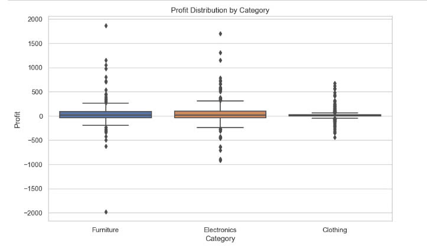

Distribution: 
- The chart shows the distribution of profits on each product category.

Reviews: 
- Can see that electronics has the highest average profit, showing strong profits, while furniture has a slightly higher average profit, bringing moderate profits, and clothing is almost zero.
- The overall profit is very low, the clothing category quartile has very limited changes, almost all profit values ​​of the group are close to zero, less than furniture and electronics, quite a lot, sometimes there can be small losses.
- The change of the furniture category can show profits and large losses, not significant, not often, electronics shows stable performance, valuable, bringing value to the business. As for clothing, it does not bring strong profits.
- The Profit column shows a wide range of values: from -2000 to 2000
Furniture: the average profit is just slightly above 0 but has high volatility, indicating inconsistent profits with some large profits and losses. The range is too wide, with high profits concentrated from 400 to over 1500, but there are also many negative profits, from -400 to over -500, with some products reaching -2000. From there, we can see the wide range in the same furniture warehouse.
Electronic: the average profit is the highest, this shows the strong performance that makes electronics a valuable field, less differentiation between products, from about -1000 to more than 1500. It can be seen that the profit from Electronic is more stable than funiture, the most sold product, the highest profit is also in the electronic (printer) warehouse.
Clothing: clothing has a low profit margin of almost 0, sells little, but the products are not too differentiated compared to the other 2 warehouses.

Lesson:
- Businesses should consider expanding investment in the electronics sector and find ways to increase items that bring high profits to the business.
- In addition, it is necessary to review the disadvantages of profit margins, all problems with the price of the competition of clothing, thereby reviewing its strategy to improve economic efficiency and strengthen home marketing strategies in sales.
- As for the interior, it can be further developed to develop the language, just need to strictly manage the profit variation.

