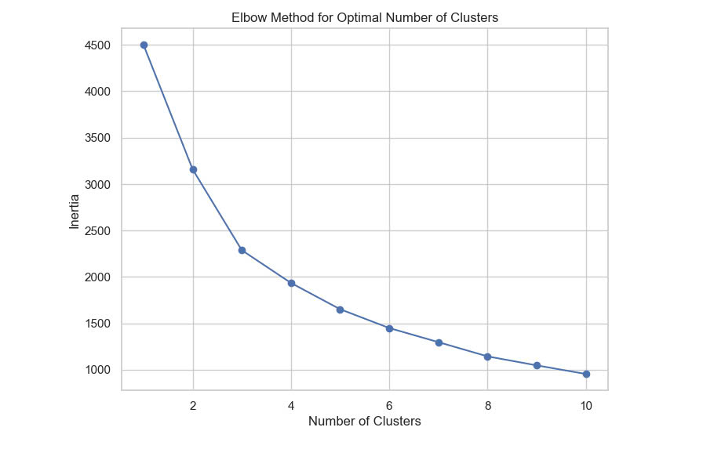

Linear Regression: 
-  Linear regression algorithm gives the result of a model used to predict the relationship between two values ​​Amount and Profit. This chart helps predict the trend from real data including two parts: data points and linear regression line.

- The blue data points show the real relationship between two values ​​Amount and Profit. It can be seen that the dispersion between these points is very large, they do not lie along the red regression line, from which the variation of these two values ​​can be seen.

- The red regression line shows the most generalized relationship between the two values, it has a positive slope, showing that the relationship between these two values ​​both increases, that is, when the Amount value increases, the Profit value also increases slightly.
- It is very clear that the R-squared value is low, showing that this model is almost unsuitable to describe the relationship between Amount and Profit.

Elbow Graph
- The elbow plot shows the values ​​from 1 to 10. It can be seen that point 3 is the most reasonable and beautiful point to use in data analysis it balances the simplicity of the model and the representation of the data it shows a stable slope from point 1 to point 3 and point 3 to point 10 also shows a more stable decrease than all the other points

K Means
+ The Kmeans chart changes the customer segmentation results according to the two values ​​of Amount and Quantity. It can be seen that customers are divided into three different colors: purple, blue and yellow. In addition, the chart also provides some indicators such as: precision, recall, and f1-score.

+ Looking at the chart details, you can see that the purple cluster clusters the first customer segment with a number of about more than 1200 customers. This customer file often buys in quantities from 0 to 9 and in addition, there are some who buy from 10 to 14 but this percentage is very small. This customer file often buys and pays mainly under 1000. It can be seen that this is the average customer segment in society and often buys with a fairly stable frequency and low price.

+ The blue segment shows that the number of customers in this customer file is more than 200 customers, mainly distributed from the purchase quantity of 2 to 9 and also a very small portion of purchases from 10 to 13. This customer file generally seems to have a higher income than the purple customer file because the amount of money they spend to buy products is higher than the purple customer file, from 500 to nearly 2000.

+ Finally, the yellow customer segment accounts for the smallest percentage of all 3 customer files, distributed from the purchase quantity of 3 to 14. However, each quantity is very different and the price segment may be higher than the other two customer files, but it may not bring much profit due to the too scattered distribution in all. It can be seen that they spend a lot of money to buy products, proving that this is a VIP customer file, a high-end customer file, and they are willing to spend money and spend a lot of money to buy the product they want. Although it is not much, it still brings a fair profit to the business, but the profit will not be equal compared to the other two customer files.

+ For the indicators that the score also brings, namely precision, recall, and f1-score, these indicators all reach 1.00, which shows that this chart has completed the task it performs very well. It has segmented customers very well based on the available data, in addition, combining the use of the Elbow chart also helps to determine the index and segment customers well like this.

+ In practice, it can be seen that this chart has helped cluster customers according to the number of products they buy and their spending level. It can be seen that the purple customer file is the average customer. Businesses can create strategies and incentives to encourage these customers to spend more because this is also a fairly stable customer spending group. For the blue customer file, which is the average customer file, their spending level is higher and quite stable, so exclusive incentive programs can be created to retain customers. Finally, for the VIP customer file, products can be promoted more, creating more quality products to attract more VIP customers for the business and sell more products.

