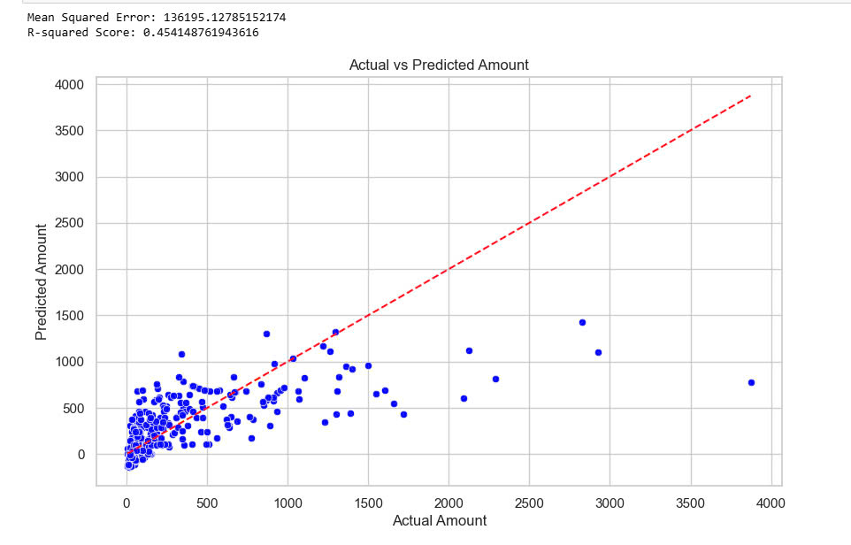

Linear Regression: 
-  Linear regression algorithm gives the result of a model used to predict the relationship between two values ​​Amount and Profit. This chart helps predict the trend from real data including two parts: data points and linear regression line.

- The blue data points show the real relationship between two values ​​Amount and Profit. It can be seen that the dispersion between these points is very large, they do not lie along the red regression line, from which the variation of these two values ​​can be seen.

- The red regression line shows the most generalized relationship between the two values, it has a positive slope, showing that the relationship between these two values ​​both increases, that is, when the Amount value increases, the Profit value also increases slightly.
- It is very clear that the R-squared value is low, showing that this model is almost unsuitable to describe the relationship between Amount and Profit.

Elbow Graph
- The elbow plot shows the values ​​from 1 to 10. It can be seen that point 3 is the most reasonable and beautiful point to use in data analysis it balances the simplicity of the model and the representation of the data it shows a stable slope from point 1 to point 3 and point 3 to point 10 also shows a more stable decrease than all the other points

K Means
- This chart shows the relationship between the three values ​​Amount, Profit and Quantity. It can be seen that this chart is more suitable for measuring these values ​​than Linear Regression. Each different colored cluster will show separate values ​​starting from low profit and low amount values ​​to higher profit transactions and finally transactions with average profit and average quantity are almost the same. Looking at each colored cluster can represent different customer files. This can help businesses build strategies to target each customer segment and bring in higher profits and sell more products.

