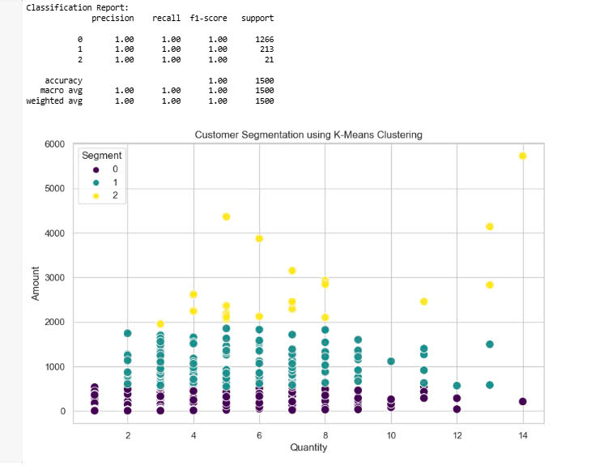
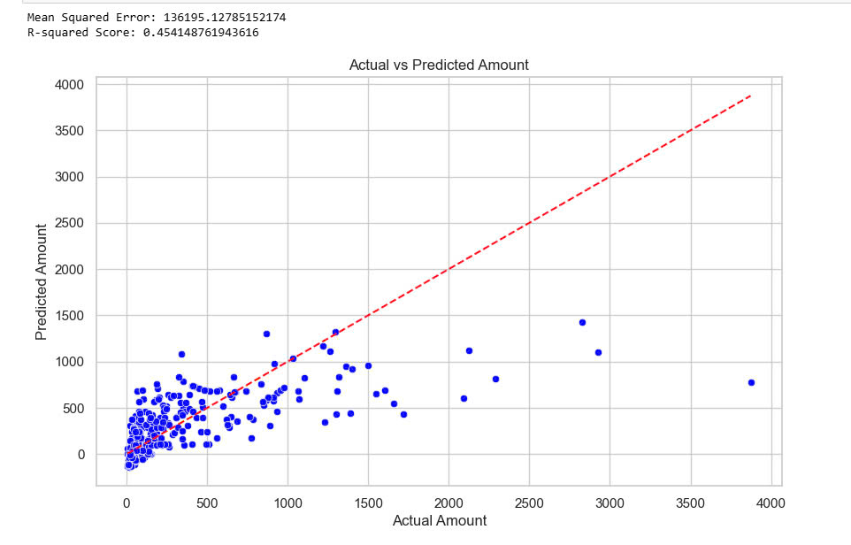

# Final project 
# Group 1 
# Online Sales
Subject: Introduction to Data Science

Class: MAS02

Lecturer: Dr. Emmanuel Lance Christopher VI M. Plan

| Student ID | Name               | Task Done                                               | Remark by Leader                    | Student Evaluation |
|------------|--------------------|---------------------------------------------------------|-------------------------------------|--------------------|
| 22080297   | Phạm Tô Bảo Anh   | Conclusion, Machine Learning, Comprehensive study of all content | Complete well, responsible, on time | 100%               |
| 22080322   | Lương Khánh Linh  | Data research, 1 bar chart, 1 scatter plot              | Complete well, responsible, on time | 100%               |
| 22080325   | Bùi Ánh Mai      | Data research, boxplot, interesting findings            | Complete well, responsible, on time | 100%               |
| 22080338   | Nguyễn Thu Phương | Data research, line chart, pie chart                    | Complete well, responsible, on time | 100%               |
| 22080339   | Tạ Thu Phương     | Data research, introduction, 1 bar chart, 1 scatter plot | Complete well, responsible, on time | 100%               |

1. Introduction
This data includes two CSV files: Order.csv and Details.csv

- In the Order.csv file, this data file provides basic customer information, including the order number when the customer placed the order, the date of order, the customer's full name, the state and city where they live. This data file takes information from the country of India, so it can be seen that the names, states and cities are all traditional, famous places in India and the customer's full names are also Indian names, they are people of origin, born and raised in India since childhood.

- In the Details.csv file, this file provides more specific data than the Order.CSV file, they still keep the order number column but have added many columns, including six columns with six different values. The Amount value provides the total sales of that product, the Profit column shows the profit earned from that product, the Quantity column shows how many products are sold. Next is the Category column, this column describes the main categories, including three categories: electronics, furniture and clothing. The next is the Sub-category, including sub-categories, specifically 14 small sub-categories equivalent to the large sub-categories in the Category. Finally, the PaymentMode column describes in detail the payment methods that customers use when purchasing and ordering, this column includes five methods: COD, Credit Card, Debit Card, UPI and EMI

2. Detailed Information
   
- Orders.csv:
+ Order ID: Identifier for each order
+ Order Date: Specific order date
+ Customer Name: Full name of customers who placed the order
+ State: State where the customer resides
+ City: City where the customer resides
  
- Details.csv:
+ Order ID: Code associated with Order csv file
+ Amount: Total order value
+ Profit: Profit earned from the order
+ Quantity: Quantity of items in the order
+ Category: Category of products
+ Sub-Category: More detailed description from the product category
+ PaymentMode: Payment methods used by customers for the transaction

3. Data Types:
- In Orders.csv, the "Order Date" column is currently in object (string) format and should be converted 
to a proper date format for any time-based analysis.

- Outliers in Numeric Data (from Details.csv): Amount: The minimum value of 4 and maximum value of 5729 appear normal, though there is a wide range.

- Profit: There are negative values in the "Profit" column, which may indicate losses. However, some values seem extreme (e.g., -1981), so these should be checked to determine if they are valid or errors.

4. Interesting findings
1. Geographical location
- There are many orders from far away places like Nagaland (Kohima), Jammu and Kashmir, Kerala (Thiruvananthapuram). Showing the wide distribution capacity of the business
- Chandigarh appears in both Punjab and Haryana (being the common administrative center of the two states)
- Some big cities like Bangalore, Chennai have few orders.
- Hyderabad appears as a city of Andhra Pradesh
=> Wide geographical distribution, orders come from different states in India, from Gujarat in the west to Nagaland in the northeast, and from Jammu and Kashmir in the north to Kerala in the south. This shows that the company has a wide range of operations.
- Diversity of cities: Orders come not only from big cities like Mumbai, Delhi, Bangalore which are the main sources of revenue for the company but also from smaller cities like Mathura, Prayagraj, Kohima. This shows that the company has the ability to serve both urban and rural areas.
- Customer name diversity: The customer list includes a variety of names, reflecting the cultural and linguistic diversity of India.
- Repeat orders: There are some customer names that appear multiple times (e.g. Madhav, Shrichand), indicating that there are regular customers or possibly dealers.
- Customer names reflect the cultural and religious diversity of India (e.g. Hindu, Muslim, Sikh). There are both traditional and modern names, indicating a diverse customer base in terms of age and culture.

2. Profit
- Electronics has the highest profit margin of all categories, reflecting its dominance in society and high demand. There is a huge gap from high losses (-916) to high profits (1864), which can happen due to excessive discounting, or during periods of high demand, production costs are higher than revenue.
- Many products in the Clothing category have negative profit margins, especially low-value items such as Handkerchiefs

5. Charts

Bar chart - Sub-category by Amount:
+ Description: Shows the total sales volume by sub-category, including 17 sub-categories with the highest volume level of 60,000.
+ Reviews: The chart has 15 main categories and the most important dead end sales are printers with sales of nearly 60,000 showing a large difference between the highest category which is printers and shirts with only about 2000 that is what we see most clearly in the chart seeing the difference between the highest and lowest product sales performance and which products are popular and which products are not popular. The reason why these products are higher than other products is because the demand for education in India is currently increasing because India is a populous country with a developed education system and the government also invests and wants to encourage the use of technology in work, study and life, so the items in the electronic warehouse are always the best-selling and highest-achieving items. However, it can be seen in the chart that the second highest column is Saree. This is a traditional costume of India and because in India they prefer to wear these traditional clothes more than normal clothes, the demand for buying these traditional clothes is always high. Next are the products that are almost equally low, which are clothing products and accessories. As mentioned in India, they prefer to wear traditional clothes like Saree. So the revenue from clothing is almost zero and accessories in their country are also popularly handmade, so the demand is also low.

Pie Chart - Payment mode:
+ Description: Provides an overview of the sales structure according to different payment methods, helping businesses make strategic decisions.
+ Reviews: COD is the highest method with more than 35%, because modern society prioritizes online shopping, so the percentage of COD usage is increasing, wanting to trust and see the product before paying. The two methods of using cards are credit cards and debit cards, which require too much personal information when paying, causing time loss and fear of information disclosure, so the percentage of usage is not too large. UPI method - unified payment system, because this data is taken from India and this method is very popular in India, so it will be suitable for many types of goods and products. Finally, EMI method - installment payment, suitable for some items in categories such as furniture or electronics, because of the high price, suitable for people who do not have enough money, and they use installment payment.

Line Chart - Monthly Profit Trend:
+ Description: Provides an overview of the monthly profit development of the enterprise.
+ Reviews: From January to March, the first quarter of the year, the demand for goods increases because as mentioned above, this data is taken from people and customers in India, from January to March in India there are very big festivals such as the Uttarayan International Kite Festival in Ahmedabad, the Ugadi Festival in Hyderabad in February, so the demand for goods increases, reaching nearly 10,000. In the low months such as March to May, June to July and August to September, there are not many special occasions or any events, so the demand of buyers also decreases. However, in July and August, the chart may increase a little because in these two months and summer, the demand for goods increases due to holidays or travel, and there are also some big events that stand out in these months such as the Indian Monsoon Festival in July-August. It can be seen that in the last months of the year in India, the demand for purchasing goods increases to a peak of more than 10,000 because there are many festivals and outstanding events of the year in these months such as Diwali Festival of Lights, Pushkar Camel Fair Festival.

Bar chart - Total Sales by State:
+ Description: Evaluate business performance and make strategic decisions.
+ Reviews: The state of "Maharashtra" has the highest sales revenue almost surpassing the other states. Next is the state of Madhya Pradesh, Uttar Pradesh. It can be seen that the large difference in the revenue of the highest and lowest state is about 34 times. States like Delhi, Rajasthan and Gujarat have relatively even revenue, are found to be stable and are potential markets in the future. The remaining states have revenue almost lower with production below 20,000 and the lowest is the state of Mizoram showing a worrying sign about the level of development of these states due to many impacts on population density, spending level and infrastructure.

Scatter Plot - Quantity of products sold and Profit:
+ Description: Shows the relationship between the number of products sold and the profit of each product.
+ Reviews: Can see the results of the dependent variable based on the milestones of the variable, and we have applied it and 2 variables have a relationship that affects each other, which is “total purchase quantity and profit”. In the chart, we see both negative and positive profits, there are points that show the highest profit that can reach more than 1500, however, there are some points that are the opposite, the total purchase quantity is not too low, however, there are many data points that are randomly scattered, which shows that many other factors can affect the profit. that is, the profit does not increase or decrease with the number of sales. This may be due to many other factors that affect the profit, such as production costs, selling prices, and marketing costs.

Boxplot - Profit distribution by category:
+ Description: Shows the distribution of profits across three product categories: Furniture, Electronics, and Clothing.
+ Reviews: The Profit column shows a wide range of values: from -2000 to 2000
Furniture: the average profit is just slightly above 0 but has high volatility, indicating inconsistent profits with some large profits and losses. The range is too wide, with high profits concentrated from 400 to over 1500, but there are also many negative profits, from -400 to over -500, with some products reaching -2000. From there, we can see the wide range in the same furniture warehouse.
Electronic: the average profit is the highest, this shows the strong performance that makes electronics a valuable field, less differentiation between products, from about -1000 to more than 1500. It can be seen that the profit from Electronic is more stable than funiture, the most sold product, the highest profit is also in the electronic (printer) warehouse.
Clothing: clothing has a low profit margin of almost 0, sells little, but the products are not too differentiated compared to the other 2 warehouses.

6. Machine Learning

Elbow Graph
+ The Elbow graph illustrates value ranging from 1 to 10, with the best value is 3, because it shows the most variation at both ends.
=> Using point 3 is the best way to analyze data in all points.

K Means
+ The Kmeans chart changes the customer segmentation results according to the two values ​​of Amount and Quantity. It can be seen that customers are divided into three different colors: purple, blue and yellow. In addition, the chart also provides some indicators such as: precision, recall, and f1-score.

Looking at the chart details, you can see that the purple cluster clusters the first customer segment with a number of about more than 1200 customers. This customer file often buys in quantities from 0 to 9 and in addition, there are some who buy from 10 to 14 but this percentage is very small. This customer file often buys and pays mainly under 1000. It can be seen that this is the average customer segment in society and often buys with a fairly stable frequency and low price.

The blue segment shows that the number of customers in this customer file is more than 200 customers, mainly distributed from the purchase quantity of 2 to 9 and also a very small portion of purchases from 10 to 13. This customer file generally seems to have a higher income than the purple customer file because the amount of money they spend to buy products is higher than the purple customer file, from 500 to nearly 2000.

Finally, the yellow customer segment accounts for the smallest percentage of all 3 customer files, distributed from the purchase quantity of 3 to 14. However, each quantity is very different and the price segment may be higher than the other two customer files, but it may not bring much profit due to the too scattered distribution in all. It can be seen that they spend a lot of money to buy products, proving that this is a VIP customer file, a high-end customer file, and they are willing to spend money and spend a lot of money to buy the product they want. Although it is not much, it still brings a fair profit to the business, but the profit will not be equal compared to the other two customer files.

For the indicators that the score also brings, namely precision, recall, and f1-score, these indicators all reach 1.00, which shows that this chart has completed the task it performs very well. It has segmented customers very well based on the available data, in addition, combining the use of the Elbow chart also helps to determine the index and segment customers well like this.

In practice, it can be seen that this chart has helped cluster customers according to the number of products they buy and their spending level. It can be seen that the purple customer file is the average customer. Businesses can create strategies and incentives to encourage these customers to spend more because this is also a fairly stable customer spending group. For the blue customer file, which is the average customer file, their spending level is higher and quite stable, so exclusive incentive programs can be created to retain customers. Finally, for the VIP customer file, products can be promoted more, creating more quality products to attract more VIP customers for the business and sell more products.

Linear Regression
+ Linear regression algorithm outputs a model to predict the relationship between two values ​​Amount and Profit. This graph helps predict trends from real wine including two parts: tourist spots and linear regression line.

