# Final project 
# Group 1 
# Online Sales
Subject: Introduction to Data Science

Class: MAS02

Lecturer: Dr. Emmanuel Lance Christopher VI M. Plan

| Student ID  | Name              | Task done      | Remark by Leader | Student evaluation |
|-------------|--------------     | -------------  | ---------------- | ------------------ |
| 22080297    | Phạm Tô Bảo Anh   |                |                  |                    |
| 22080322    | Lương Khánh Linh  |                |                  |                    |
| 22080325    | Bùi Ánh Mai       |                |                  |                    |
| 22080338    | Nguyễn Thu Phương |                |                  |                    |
| 22080339    | Tạ Thu Phương     |                |                  |                    |

1. Introduction

2. Detailed Information
   
- Orders.csv:
+ Order ID: 
+ Order Date: 
+ Customer Name: 
+ State: 
+ City: 
  
- Details.csv:
+ Order ID: 
+ Amount: 
+ Profit: 
+ Quantity: 
+ Category: 
+ Sub-Category: 
+ PaymentMode: 

3. Data Types:
- In Orders.csv, the "Order Date" column is currently in object (string) format and should be converted 
to a proper date format for any time-based analysis.

- Outliers in Numeric Data (from Details.csv): Amount: The minimum value of 4 and maximum value of 5729 appear normal, though there is a wide range.

- Profit: There are negative values in the "Profit" column, which may indicate losses. However, some values seem extreme (e.g., -1981), so these should be checked to determine if they are valid or errors.

4. Charts
- Bar chart - Sub-category by Amount:
+ Description: Shows the total sales volume by sub-category, including 17 sub-categories with the highest volume level of 60,000.
+ Reviews: The sub-category with the highest sales is "Printers" with a quantity of about 60,000 while the sub-category with the lowest is "Skirt" with a quantity of only about 2,000
+ Purpose: Compare and analyze the effectiveness and sales performance between product sub-categories.
+ Lesson: Focus on key products, change weak products, diversify products, create differences
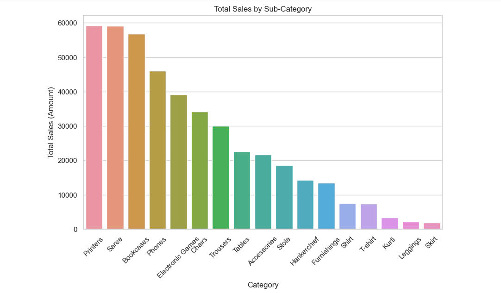

- Pie Chart - Payment mode:
+ Description: Provides an overview of the sales structure according to different payment methods, helping businesses make strategic decisions
+ Reviews: Cash on delivery (COD) accounts for the highest percentage, debit cards account for the lowest percentage of all payment methods
+ Purpose: Visualize the percentage of each different payment method chosen by customers when making a purchase
+ Lesson: Understand customer behavior, diversify payment methods and focus on key methods
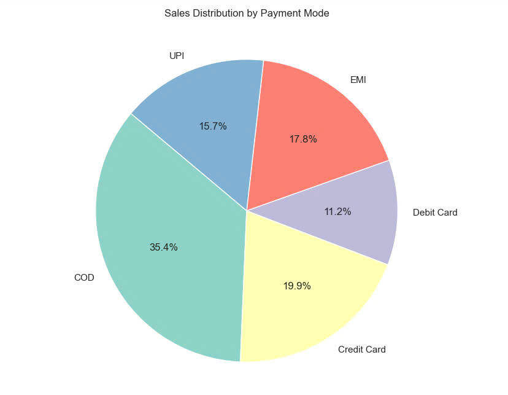

- Line Chart - Monthly Profit Trend:
+ Description: Provides an overview of the monthly profit development of the enterprise
+ Reviews: Profits reached the highest point around November 2018, and dropped to the lowest level around May 2018
+ Purpose: Illustrate the fluctuations in profits over time, support analysis and decision making
+ Lesson: Understand profit fluctuations, recognize risks plan and forecast
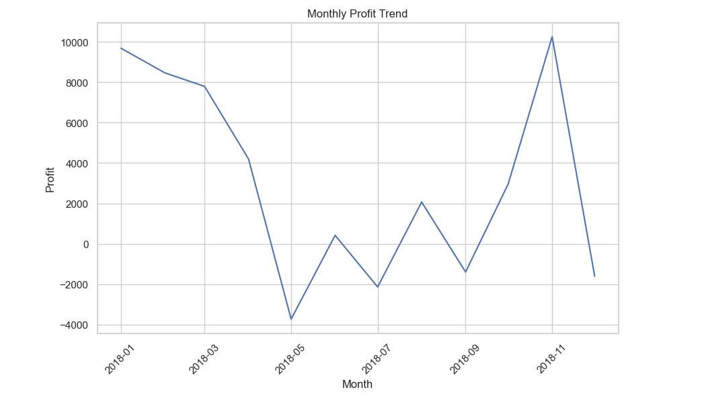

- Bar chart - Total Sales by State:
+ Description: Evaluate business performance and make strategic decisions
+ Reviews: The state of "Maharashtra" has the highest revenue, incontrast "Mizoram" has the lowest revenue, shows a large difference in revenue between states
+ Purpose: Compare revenue, evaluate and develop business performance
+ Lesson: Focus and expand key markets, improve business strategy
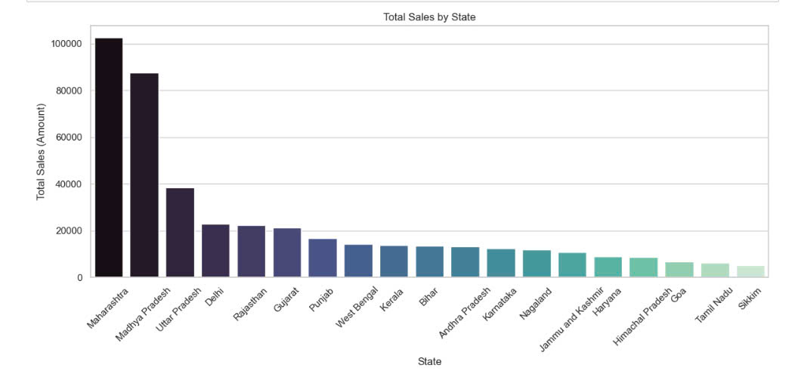

- Scatter Plot - Quantity of products sold and Profit:
+ Description: Shows the relationship between the number of products sold and the profit of each product
+ Reviews: Very high profits but have some negative profits, large quantity but not the only deciding factor
+ Purpose: Identify key and weak products, evaluate the effectiveness of marketing campaigns
+ Lesson: Quantity does not determine profits, develop an sensible pricing strategy
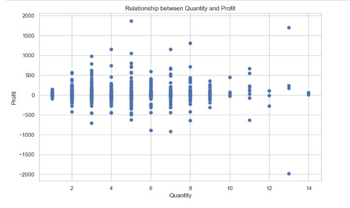

- Boxplot - Profit distribution by category:
+ Description: Shows the distribution of profits across three product categories: Furniture, Electronics, and Clothing.
+ Reviews: The median profit of electronics is the highest point, this number in funiture is higher than zero, in clothing is nearly zero
+ Purpose: Reduce large losses and optimize profit, cost control, finding a new marketing strategy, discontinuing low-performing products
+ Lesson: Focus resources on electronics, cost and marketing optimization
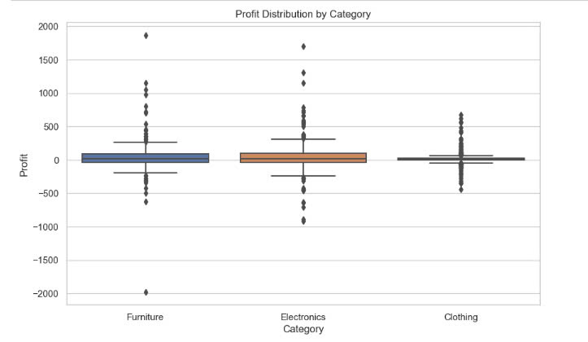

5. Machine Learning
- Elbow Graph
+ The Elbow graph illustrates value ranging from 1 to 10, with the best value is 3, because it shows the most variation at both ends.
=> Using point 3 is the best way to analyze data in all points.
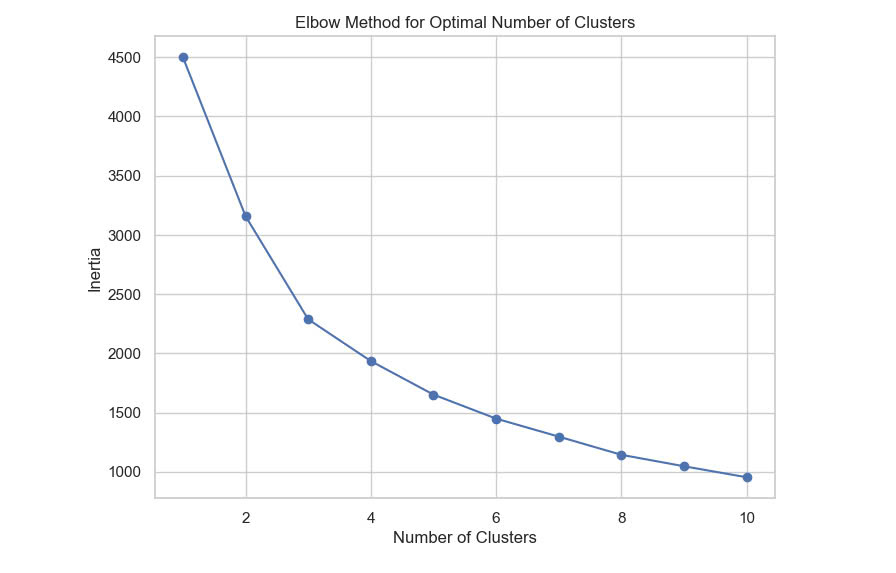
- Scatter Plot 
+ Shows the difference from 3 value: Amount, Quantity, Profit.
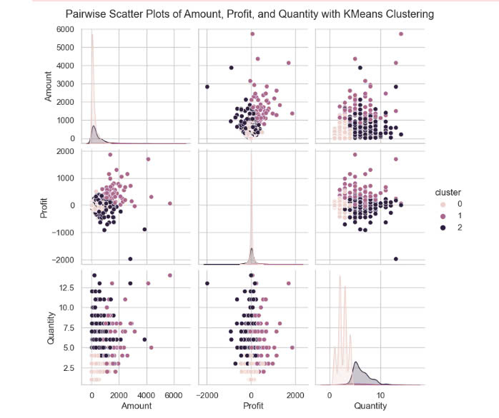
- PCA graph
+ The clusters are clearly divided, with different colors, the color patches do not overlap, showing that the KMeans algorithm has analyzed the data well.
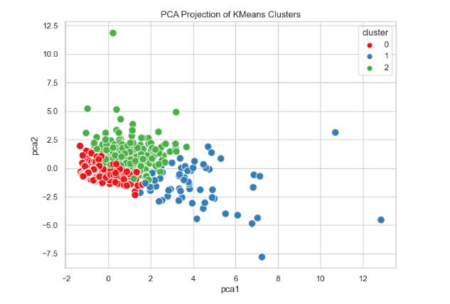
- Linear Regression
+ Linear regression algorithm outputs a model to predict the relationship between two values ​​Amount and Profit. This graph helps predict trends from real wine including two parts: tourist spots and linear regression line.
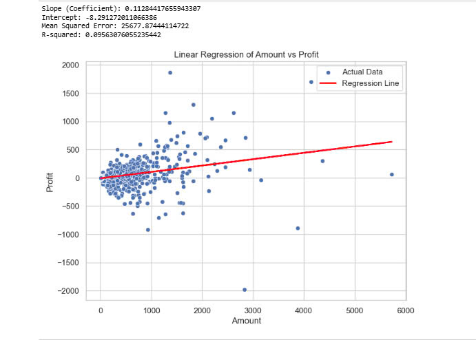
- Logistic Regression
+ The chart shows the correct and incorrect prediction rates on the two values ​​High profit and Low profit, and also gives the results of accuracy, F1 score, thereby providing information about the model performance.
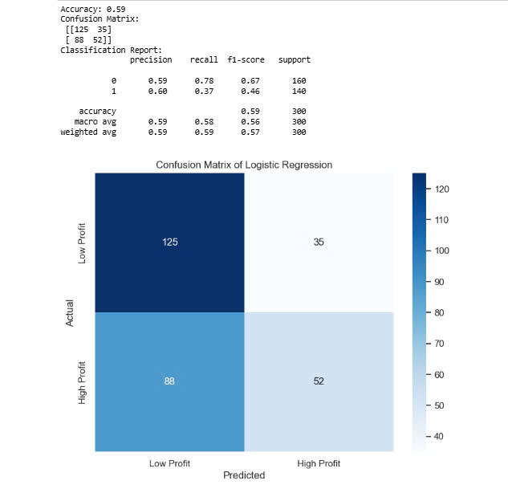
